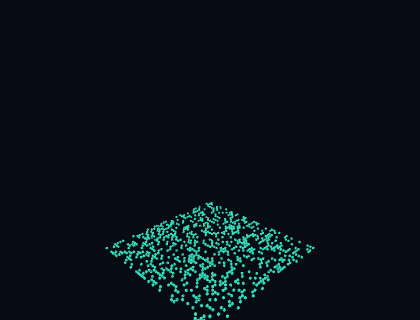

# 3D Game of Life

Conway's Game of Life with the time axis drawn. Each generation is frozen as a horizontal layer and
stacked on the one before it, so a pattern's whole history becomes a solid form you can orbit.

**[See it running →](https://goluniverse.cc)**



*The first few seconds of a run: a random seed, generations accumulating upward, stable regions rising as
coloured pillars.*

## The third axis is time, not space

This is **not** a three-dimensional cellular automaton. Cells have eight neighbours, all within one layer,
under classic B3/S23 rules. Nothing is computed in 3D.

What the third dimension shows is *when*. A glider stops being a small cluster and becomes a diagonal
streak. A still life becomes a pillar. An oscillator becomes a fluted column. None of those shapes are
visible in a flat renderer, because the axis they exist along is never drawn.

## Two things the colours tell you

**Colour is age.** A cell moves along the palette as it survives — aqua at birth, through blue and violet,
to red as it approaches death. The palette is a countdown, so a settled region and a churning one look
different at a glance.

**Fade is depth.** Layers dissolve as they descend. History is a fixed window that flows past, never an
archive: the structure reaches a constant height and stays there, growing at the top and dissolving at the
bottom.

## One deliberate departure from Conway

A cell that reaches a maximum age dies, regardless of how many neighbours it has.

Without it, a bounded grid decays into still lifes within a few hundred generations, and from that point
the structure is unchanging vertical stripes extruding forever — visually dead. Capping cell age means no
configuration is permanently stable, so movement keeps re-seeding itself into regions that had stopped.

The cap is also the far end of the colour gradient, which is why colour reads as a countdown.

## Navigating

| | Mouse | Touch |
|---|---|---|
| Orbit | drag | one finger |
| Zoom | wheel | pinch |
| Pan | right-drag | two fingers |

The camera is not clamped above the horizon — you can go underneath it.

## Running it

```bash
pnpm install
pnpm dev
```

| | |
|---|---|
| `pnpm test` | Unit tests — simulation, history window, ring arithmetic |
| `pnpm lint` | Biome |
| `pnpm typecheck` | `tsc --noEmit` |
| `pnpm build` | Production bundle |
| `pnpm smoke` | Headless render check against a running preview |
| `pnpm deploy` | Cloudflare Workers |

Built with TypeScript, three.js, and Vite. The whole structure is one instanced draw call: cell placement,
colour, and fade are derived in the vertex shader from a single generation counter, so per-frame CPU work
stays constant no matter how many cells are alive.

## How it was built

Every issue in this repository was specified, implemented, reviewed, and closed through
[zalwa](https://github.com/WrathZA/zalwa) — the PRD, tech stack, and design principles live in `.zalwa/`,
and each merged pull request carries its own persona review and PRD coverage check.
